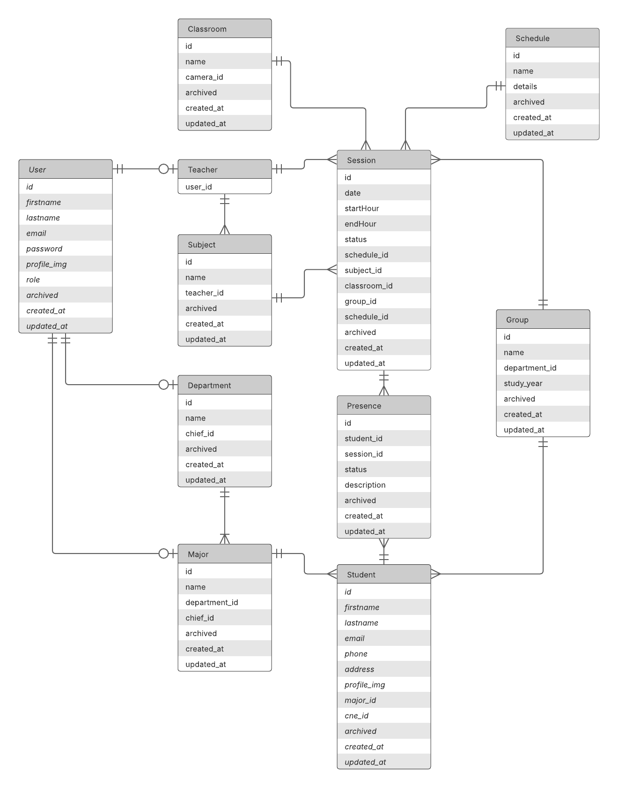
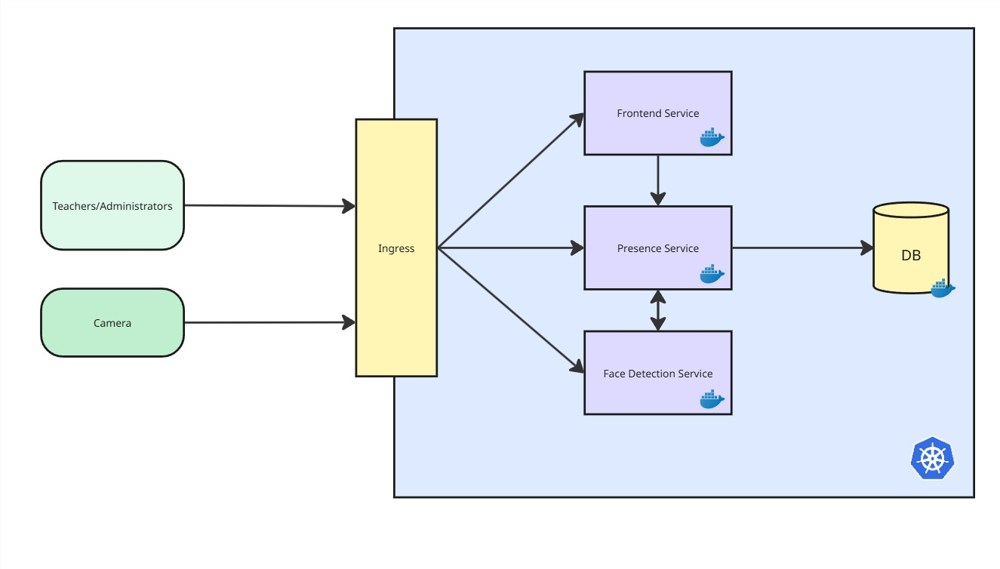

# Attendance AI - Backend
## Folder Structure
```
src/main/java/com/yourcompany/presencemanagement/
├── api/                       # API layer
│   ├── controller/            # REST controllers
│   │   └── auth/              # AUTH REST controllers
│   ├── advice/                # Exception handlers and controller advices
│   ├── request/               # Request DTOs
│   └── response/              # Response DTOs
├── config/                    # Configuration classes
│   ├── security/              # Security configurations
│   └── swagger/               # API documentation
├── domain/                    # Domain model
│   ├── enums/                 # Enumerations
│   ├── entity/                # JPA entities
│   ├── repository/            # Spring Data repositories
│   ├── dto/                   # DTO Layer
│   └── mapper/                # Entity-DTO mappers
├── exception/                 # Custom exceptions
├── service/                   # Business logic
│   ├── impl/                  # Service implementations
│   └── specification/         # JPA specifications for queries
└── util/                      # Utility classes
```

## Swagger link
```
http://localhost:8086/swagger-ui/index.html#
```

## Database Architecture


## System Design

